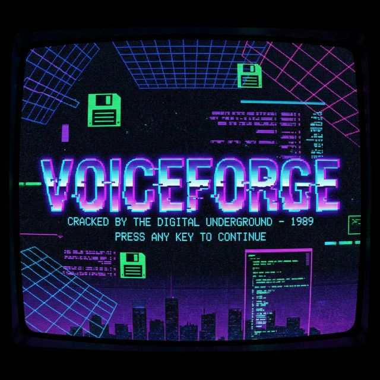

# VoiceForge 🎙️

<p align="center">
  
</p>

A modern text-to-speech application powered by **Qwen3-TTS** from Alibaba Cloud.

> 📖 **[View the Quick Tutorial](./TUTORIAL.md)** for a guide on how to use the app!

## Features

- **🎭 Voice Presets** - Generate speech using curated voice characters with emotion control
- **✨ Voice Design** - Create unique voices from natural language descriptions
- **🎤 Voice Cloning** - Clone any voice from a reference audio sample
- **🌍 Multilingual** - Supports 10+ languages including English, Chinese, Japanese, Korean, and more
- **⚡ Low Latency** - Ultra-fast streaming generation with <100ms latency

## Tech Stack

- **Backend**: Python FastAPI + Qwen3-TTS
- **Frontend**: Next.js + TailwindCSS
- **Models**: Qwen3-TTS-12Hz-1.7B series

## Prerequisites

- Python 3.12+
- Node.js 18+
- macOS (MPS acceleration) or Linux with NVIDIA GPU (CUDA)
- ~8GB RAM minimum (16GB recommended)

## Quick Start

### 1. Backend Setup

```bash
# Navigate to project root
cd voiceforge-qwen3

# Create and activate virtual environment
python3.12 -m venv venv
source venv/bin/activate

# Install dependencies
cd backend
pip install -r requirements.txt

# Run the server
cd ..
python -m uvicorn backend.main:app --host 0.0.0.0 --port 8000 --reload
```

The API will be available at http://localhost:8000

- **API Docs**: http://localhost:8000/docs
- **Health Check**: http://localhost:8000/health

### 2. Frontend Setup

```bash
# In a new terminal
cd voiceforge-qwen3/frontend

# Install dependencies
npm install

# Start development server
npm run dev
```

The UI will be available at http://localhost:3000

## API Endpoints

| Endpoint | Method | Description |
|----------|--------|-------------|
| `/api/tts/preset` | POST | Generate speech with preset voice |
| `/api/tts/design` | POST | Generate with designed voice |
| `/api/tts/clone` | POST | Clone voice from reference |
| `/api/presets` | GET | List available presets |
| `/api/languages` | GET | List supported languages |
| `/api/status` | GET | Get engine status |

## Model Information

VoiceForge uses the Qwen3-TTS model family:

| Model Type | 1.7B (High Quality) | 0.6B (Fast/Low VRAM) | Use Case |
|------------|---------------------|----------------------|----------|
| CustomVoice | ✅ | ✅ | Preset voices |
| VoiceDesign | ✅ | ❌ | Voice from description |
| Base | ✅ | ✅ | Voice cloning |

Models are downloaded automatically on first use.

### Model Selection

You can select the desired model size (1.7B vs 0.6B) directly in the VoiceForge UI.
- **1.7B**: Higher quality, requires ~4-8GB VRAM/RAM
- **0.6B**: Faster generation, requires ~2-4GB VRAM/RAM

> **Note**: Voice Design is currently only available with the 1.7B model.

## Environment Variables

| Variable | Default | Description |
|----------|---------|-------------|
| `VOICEFORGE_DEVICE` | `auto` | Force device: `cpu`, `cuda`, `mps` |

## Supported Languages

- Chinese 🇨🇳
- English 🇺🇸🇬🇧
- Japanese 🇯🇵
- Korean 🇰🇷
- German 🇩🇪
- French 🇫🇷
- Russian 🇷🇺
- Portuguese 🇵🇹🇧🇷
- Spanish 🇪🇸
- Italian 🇮🇹
- Auto (automatic detection)

## Troubleshooting

### "CUDA out of memory"
- Use smaller models: `export VOICEFORGE_SMALL_MODELS=1`
- Reduce batch sizes
- Restart the server to clear GPU memory

### Models not loading
- Ensure you have ~20GB free disk space for model downloads
- Check internet connection for HuggingFace access
- Try manual download: `huggingface-cli download Qwen/Qwen3-TTS-12Hz-1.7B-CustomVoice`

### Mac MPS issues
- MPS uses float32 (higher memory than CUDA's bfloat16)
- Close other GPU-intensive apps
- Consider using 0.6B models

### Backend not connecting
- Ensure backend is running on port 8000
- Check CORS settings in `main.py`
- Verify firewall settings

## Development

### Project Structure

```
voiceforge-qwen3/
├── backend/
│   ├── app/
│   │   ├── api/
│   │   │   └── routes.py      # API endpoints
│   │   └── core/
│   │       └── tts_engine.py  # Qwen3-TTS integration
│   ├── main.py                # FastAPI app
│   └── requirements.txt
├── frontend/
│   ├── app/
│   │   ├── page.tsx           # Main UI
│   │   └── globals.css
│   └── package.json
└── README.md
```

## Credits

- **Qwen3-TTS**: Developed by [Qwen Team at Alibaba Cloud](https://github.com/QwenLM/Qwen3-TTS)
- **License**: Apache 2.0

